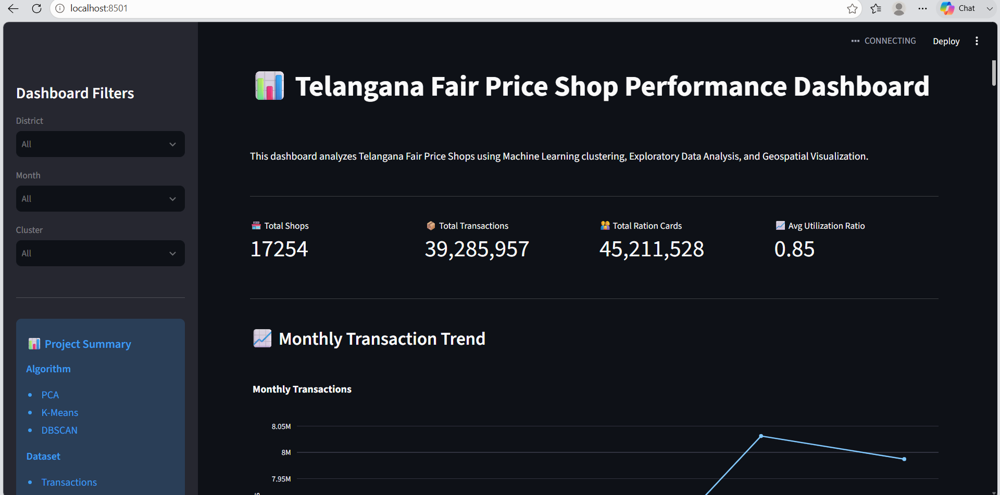
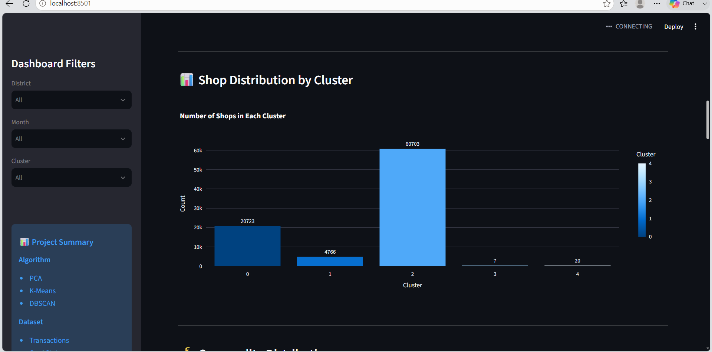
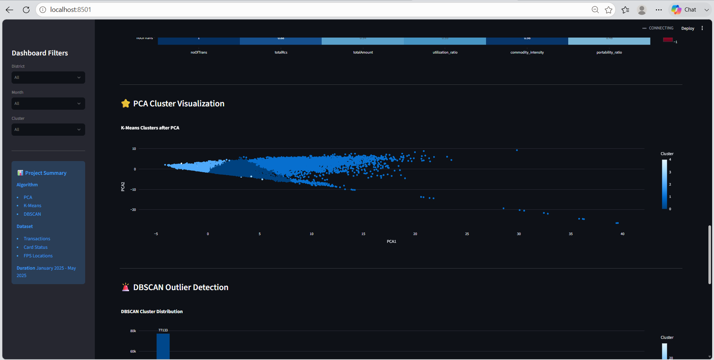
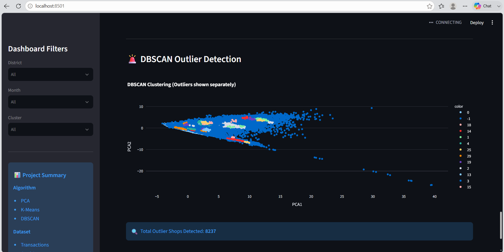
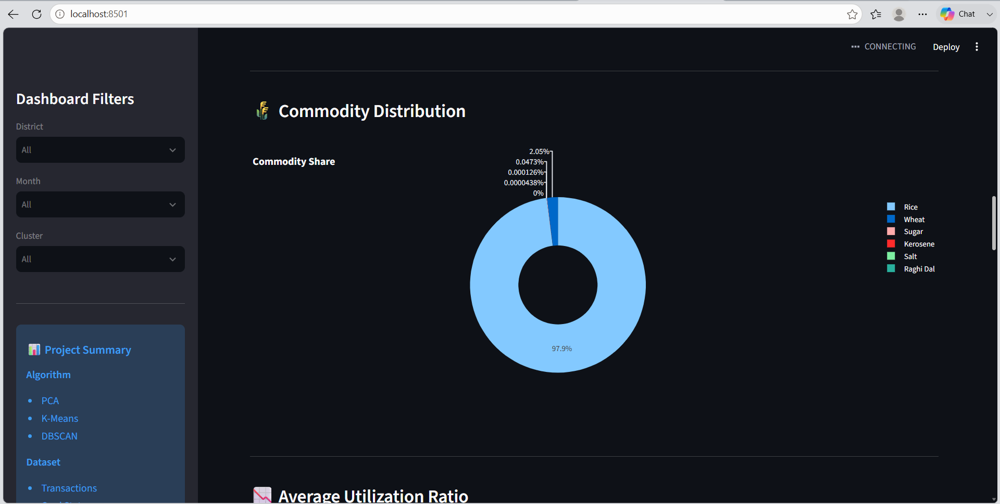

# 📊 Telangana Fair Price Shop (FPS) Performance Clustering

## 📌 Project Overview

The Telangana State Civil Supplies Department operates thousands of Fair Price Shops (FPS) across the state. Monitoring the performance of these shops manually is difficult due to the large volume of transactions and beneficiaries.

This project uses **Machine Learning clustering techniques** to analyze Fair Price Shop performance, identify behavioral patterns, detect unusual shops, and provide an interactive dashboard for decision-makers.

---

# 🎯 Problem Statement

Identify meaningful clusters of Fair Price Shops based on:

- Transaction volume
- Ration card utilization
- Commodity distribution
- Portability (One Nation One Ration Card)
- Geographical location

The project helps in:

- Policy Impact Analysis
- Fraud Detection
- Logistics Optimization
- Shop Performance Monitoring

---

# 📂 Dataset

**Source:**
Telangana Open Data Portal

### Datasets Used

- Transactions Data (2023–2025)
- Card Status Data
- FPS Location Data

These datasets were merged using:

- shopNo
- distCode
- officeCode
- month
- year

---

# ⚙️ Technologies Used

- Python
- Pandas
- NumPy
- Matplotlib
- Plotly
- Scikit-Learn
- Streamlit
- Folium
- PCA
- K-Means Clustering
- DBSCAN

---

# 🧹 Data Preprocessing

The following preprocessing steps were performed:

- Missing value handling
- Duplicate removal
- Data type conversion
- Triple Dataset Join
- Feature Engineering
- Data Scaling

---

# 📈 Exploratory Data Analysis

The project includes:

- Monthly Transaction Trend
- Portability Trend
- Commodity Distribution
- Correlation Analysis
- District-wise Performance
- Utilization Analysis

---

# ⚡ Feature Engineering

Created new features including:

- Utilization Ratio
- Portability Ratio
- Rice-Wheat Ratio
- Commodity Intensity
- Amount per Card
- Units per Card

---

# 🤖 Machine Learning

## Principal Component Analysis (PCA)

Reduced multiple features into two principal components for visualization.

---

## K-Means Clustering

Segmented Fair Price Shops into five behavioral clusters.

### Cluster Types

- 🟢 High Performing Shops
- 🔵 Medium Performing Shops
- 🟡 Low Performing Shops
- 🟠 Rare Behaviour Shops
- 🔴 Outlier Shops

---

## DBSCAN

Detected anomalous Fair Price Shops that do not belong to any major cluster.

These outliers can indicate:

- Ghost beneficiaries
- Stock diversion
- Exceptional demand
- Operational anomalies

---

# 📊 Streamlit Dashboard Features

The dashboard provides:

- 📍 District Filter
- 📅 Month Filter
- 📦 Cluster Filter
- 📈 Monthly Trend
- 🚚 Portability Trend
- 📊 Cluster Distribution
- 🌾 Commodity Distribution
- 📉 Utilization Ratio
- 🔥 Correlation Heatmap
- ⭐ PCA Visualization
- 🚨 DBSCAN Outlier Detection
- 🗺️ Telangana FPS Map
- 🔍 Shop Performance Search
- 📋 Cluster Profile
- 📥 Download Filtered Dataset

---

# 📊 Results

The clustering model successfully segmented Fair Price Shops into meaningful performance groups.

Major outcomes include:

- Identification of high-performing shops
- Detection of abnormal transaction patterns
- Visualization of geographical cluster distribution
- Improved understanding of portability behavior
- Data-driven recommendations for policy makers

---

# 💡 Business Recommendations

- Increase stock allocation for high-performing shops.
- Monitor portability hubs regularly.
- Investigate DBSCAN outliers.
- Improve awareness in low-utilization regions.
- Use cluster analysis for policy planning.

---

# 📁 Project Structure

```
Telangana_PDS_Shop_Clustering
│
├── app.py
├── requirements.txt
├── README.md
├── Project_Report.md
├── .gitignore
│
├── data
│   ├── raw
│   └── processed
│
├── notebooks
│
└── images
```

---

# 🚀 Run the Project

Clone the repository

```bash
git clone <your-repository-url>
```

Install dependencies

```bash
pip install -r requirements.txt
```

Run the Streamlit application

```bash
streamlit run app.py
```

---

# 📷 Dashboard Screenshots

## 🏠 Dashboard Overview

The Streamlit dashboard provides an interactive overview of Telangana Fair Price Shop (FPS) performance with filters, KPI cards, charts, and geospatial visualization.



---

## 📊 Shop Distribution by Cluster

Fair Price Shops are grouped into behavioral clusters using the K-Means clustering algorithm, helping identify high-performing, medium-performing, and low-performing shops.



---

## ⭐ PCA Cluster Visualization

Principal Component Analysis (PCA) reduces the dimensionality of the dataset and visualizes cluster separation in a two-dimensional space.



---

## 🚨 DBSCAN Outlier Detection

DBSCAN identifies anomalous Fair Price Shops that exhibit unusual transaction behavior and do not belong to any major cluster.



---

## 🌾 Commodity Distribution

This chart illustrates the distribution of essential commodities across Fair Price Shops, providing insights into commodity allocation and utilization patterns.



---

# 👩‍💻 Author

**Mercy Rithcia**

Aspiring Data Analyst | Python | SQL | Power BI | Machine Learning

---

# ⭐ Future Improvements

- Real-time FPS monitoring
- Predictive analytics for stock demand
- Fraud prediction using anomaly detection
- Time-series forecasting
- Live dashboard deployment

---

## ⭐ Thank You